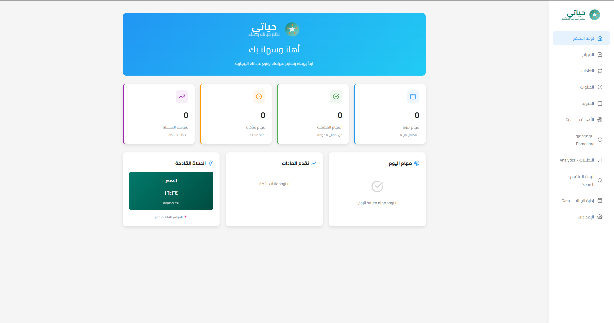
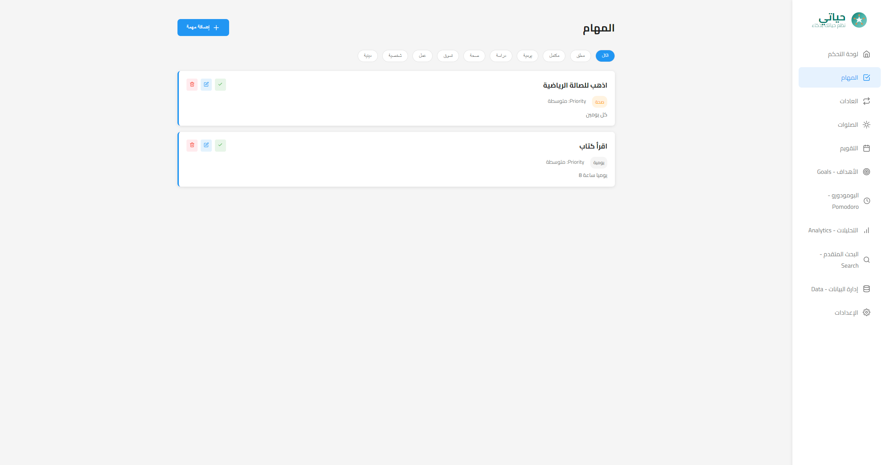
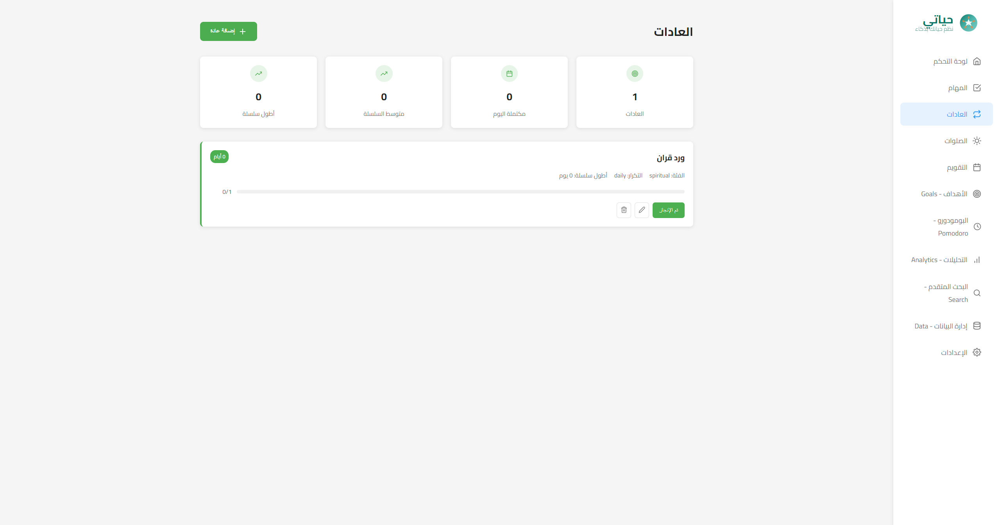
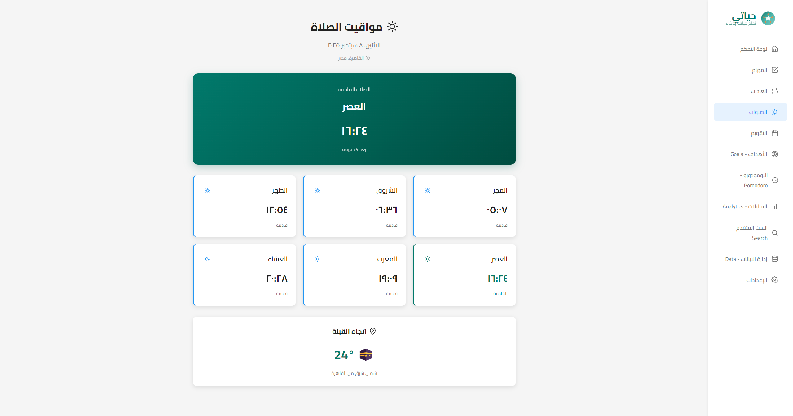

<div align="center">

# حياتي - Hayati 

### **نظم حياتك بذكاء** | *Organize your life intelligently*

[](https://opensource.org/licenses/MIT)
[](https://www.typescriptlang.org/)
[](https://www.electronjs.org/)
[](https://reactjs.org/)
[](https://github.com/moazmo/hayati/releases)
[](https://github.com/moazmo/hayati/stargazers)

**A beautifully crafted Arabic-first life management desktop application built with Electron, React, and TypeScript**

[📥 Download](#-download--installation) • [✨ Features](#-features) • [🖼️ Screenshots](#-screenshots) • [🛠️ Development](#-development-setup) • [🤝 Contributing](#-contributing)

</div>

---

## 🌟 About

As a Muslim developer, I wanted to create something that would help our community stay organized while keeping our Islamic values at the center. **Hayati** (My Life) is a desktop app I built to manage daily tasks, track positive habits, and never miss prayer times.

The app is designed **Arabic-first** because I believe our language deserves better representation in technology. Everything from the UI to the notifications respects our culture and values.

**حياتي** هو تطبيق طورته لمساعدة إخواني المسلمين في تنظيم حياتهم اليومية. يدعم اللغة العربية بشكل كامل ويحترم قيمنا الإسلامية في كل جانب من جوانبه.

---

## 📥 Download & Installation

### 🎯 Ready to Use - Windows Executable

<div align="center">

**[⬇️ Download Hayati-App-Portable.zip](https://github.com/moazmo/hayati/releases/latest)**


</div>

#### 🚀 Quick Start:
1. **Download** the portable ZIP file from [releases](https://github.com/moazmo/hayati/releases/latest)
2. **Extract** to any folder on your computer
3. **Double-click** `حياتي - Hayati.exe`
4. **Start** organizing your life!

> ✅ **No installation required** - Just download, extract, and run!  
> ✅ **Portable** - Carry it on a USB stick or cloud storage  
> ✅ **Self-contained** - All dependencies included

---

## 🖼️ Screenshots

<div align="center">
  
  
</div>

<div align="center">
  
  
</div>

---

## ✨ Features

### 📋 **Task Management**
- Create and organize daily tasks in Arabic or English
- Set priorities and due dates with smart reminders
- Categories and tags for better organization
- Progress tracking and completion analytics

### 🎯 **Habit Tracking**
- Track daily habits like Quran reading, exercise, or dhikr
- Visual streak tracking and progress analytics
- Islamic habit templates included
- Motivational quotes and reminders

### 🕌 **Prayer Times**
- Accurate prayer times for your location
- Beautiful prayer reminders and notifications
- Multiple calculation methods supported
- Qibla direction and Islamic calendar

### ⚡ **Smart Features**
- **Quick Actions** panel (Ctrl+K) for fast navigation
- **System tray** support - runs in background
- **Export/import** your data anytime
- **Dark and light** themes with Arabic typography
- **Offline-first** - works without internet
- **Privacy-focused** - all data stored locally

---

## 🛠️ Development Setup

### Prerequisites


### 🚀 Getting Started

```bash
# Clone the repository
git clone https://github.com/moazmo/hayati.git
cd hayati

# Install dependencies
npm install

# Start development server
npm run dev

# Build for production
npm run dist
```

### 📦 Available Scripts

- `npm run dev` - Start development with live-reloading
- `npm run build` - Build the app for production
- `npm run dist` - Create Windows executable
- `npm run preview` - Preview the built app

---

## 🏗️ Technical Stack

<div align="center">

| Frontend | Backend | Desktop | Language |
|----------|---------|---------|----------|
|  |  |  |  |
|  |  |  |  |
|  | | | |

</div>

---

## 🤝 Contributing

We welcome contributions from the community! Here's how you can help:

### 🐛 **Found a Bug?**
- Check [existing issues](https://github.com/moazmo/hayati/issues) first
- Create a [new issue](https://github.com/moazmo/hayati/issues/new) with detailed information

### 💡 **Have an Idea?**
- Open a [feature request](https://github.com/moazmo/hayati/issues/new)
- Join discussions in [GitHub Discussions](https://github.com/moazmo/hayati/discussions)

### 🔧 **Want to Code?**
1. Fork the repository
2. Create a feature branch: `git checkout -b feature/amazing-feature`
3. Commit your changes: `git commit -m 'Add amazing feature'`
4. Push to the branch: `git push origin feature/amazing-feature`
5. Open a Pull Request

---

## 📄 License

This project is licensed under the MIT License - see the [LICENSE](LICENSE) file for details.

---

## 🙏 Acknowledgments

- Thanks to the amazing open-source community
- Islamic prayer time calculations powered by [Adhan](https://github.com/batoulapps/adhan-js)
- Icons from [React Icons](https://react-icons.github.io/react-icons/)
- Built with love for the Muslim community ❤️

---

<div align="center">

**Made with ❤️ by [Moaz Mohamed](https://github.com/moazmo)**

**If you find this project helpful, please consider giving it a ⭐️**

[](https://github.com/moazmo/hayati/stargazers)
[](https://github.com/moazmo/hayati/network/members)

[Report Bug](https://github.com/moazmo/hayati/issues) • [Request Feature](https://github.com/moazmo/hayati/issues) • [Join Community](https://github.com/moazmo/hayati/discussions)

</div>

## Features

**Task Management**
- Create and organize daily tasks in Arabic or English
- Set priorities and due dates  
- Categories and smart reminders

**Habit Tracking**
- Track daily habits like Quran reading, exercise, or dhikr
- Visual streak tracking and progress analytics
- Islamic habit templates included

**Prayer Times**
- Accurate prayer times for your location
- Beautiful prayer reminders and notifications
- Multiple calculation methods supported

**Smart Features**
- Quick Actions panel (Ctrl+K) for fast navigation
- System tray support - runs in background
- Export/import your data anytime
- Dark and light themes

## �️ Getting Started

### Prerequisites

- Node.js (v18 or higher)
- npm or yarn  
- Git

### Installation

1. **Clone the repository**
   ```bash
   git clone https://github.com/moazmo/hayati.git
   cd hayati
   ```

2. **Install dependencies**
   ```bash
   npm install
   ```

3. **Start the app**
   ```bash
   npm run dev
   ```

The app will open in Electron with a live-reloading development environment.

## Development

### Project Structure

```
hayati/
├── src/
│   ├── main/           # Electron main process
│   │   ├── main.ts     # Main entry point
│   │   ├── preload.js  # Preload script
│   │   └── services/   # Database and services
│   ├── renderer/       # React frontend
│   │   ├── components/ # Reusable components
│   │   ├── pages/      # Application pages
│   │   ├── services/   # Frontend services
│   │   ├── store/      # Redux store
│   │   └── types/      # TypeScript definitions
│   └── shared/         # Shared types and utilities
├── docs/               # Documentation
├── dist/               # Built application
└── package.json
```

### Available Scripts | الأوامر المتاحة

- `npm run dev` - Start development server
- `npm run build` - Build for production
### Available Scripts

- `npm run dev` - Start development server
- `npm run build` - Build for production  
- `npm run package` - Package application for distribution
- `npm run lint` - Run ESLint

### Tech Stack

- **Frontend**: React 18, TypeScript, Styled Components
- **Backend**: Electron, Node.js, SQLite
- **State Management**: Redux Toolkit
- **Icons**: React Icons (Feather)
- **Fonts**: Cairo (Arabic), Segoe UI (English)
- **Build Tools**: Vite, Electron Builder

## Contributing

Contributions are welcome! Please read the [Contributing Guidelines](CONTRIBUTING.md) first.

1. Fork the repository
2. Create a feature branch (`git checkout -b feature/new-feature`)
3. Commit your changes (`git commit -m 'Add new feature'`)
4. Push to the branch (`git push origin feature/new-feature`)
5. Open a Pull Request

## License

This project is licensed under the MIT License - see the [LICENSE](LICENSE) file for details.

## Support

- **Issues**: [GitHub Issues](https://github.com/moazmo/hayati/issues)
- **Discussions**: [GitHub Discussions](https://github.com/moazmo/hayati/discussions)

---

Built with ❤️ for the Muslim community | صُنع بـ ❤️ للمجتمع المسلم
